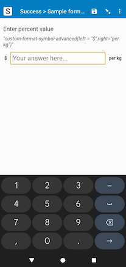

# Advanced format symbol



## Description

This field plug-in displays symbols before, after, or below an input field with flexible layout options. It allows for precise control over symbol placement and sizing, making it ideal for formatting monetary values, measurements, or any data that requires consistent presentation.

This plug-in extends the functionality of the basic [format-symbol](https://github.com/surveycto/format-symbol) field plug-in. If you're looking for a simpler solution with fewer options, you might want to check out the original format-symbol plug-in instead.

[](https://github.com/surveycto/format-symbol-advanced/raw/main/format-symbol-advanced.fieldplugin.zip)

### Features

1.  Add symbols to the left, right, or below the input field.
2.  Flexible layout with intelligent space distribution.
3.  Configurable input field width as a percentage of available space.
4.  Proper text wrapping for symbols and vertical alignment of inline elements.
5.  Horizontal centering for symbols below the input row.

This field plug-in also inherits functionality from the [baseline-decimal](https://github.com/surveycto/baseline-decimal) field plug-in.

### Data format

This field plug-in requires the `decimal` field type.

## How to use

### Getting started

**To use this plug-in as-is**

1. Download the [sample form](https://github.com/surveycto/format-symbol-advanced/raw/57ffd24d34a99958a2dfcac894eea012da0f8f0e/extras/sample-form/Sample%20form%20-%20Advanced%20format%20symbol%20field%20plug-in.xlsx) from this repo and upload it to your SurveyCTO server.
2. Download the [format-symbol-advanced.fieldplugin.zip](https://github.com/surveycto/format-symbol-advanced/raw/main/format-symbol-advanced.fieldplugin.zip) file from this repo, and attach it to the sample form on your SurveyCTO server.

### Parameters

| Parameter key | Parameter value |
| --- | --- |
| `left` (optional) | Text/symbol to display to the left of the input field. |
| `right` (optional) | Text/symbol to display to the right of the input field. |
| `below` (optional) | Text/symbol to display centered below the input field row. |
| `field-width` (optional) | Controls the width of the input field as a percentage of the total container width. Accepted values: `half`, `third`, `quarter`, `two-thirds`, `fifth`, or a custom percentage value (e.g., `40`). |

### Field-width behavior

**When `field-width` is used:**
- The input field takes the specified fixed percentage width.
- Symbols take their natural width based on content, do not grow, and are capped by the remaining space (split if both left/right symbols are present).
- The input field and symbols align to the start (left in LTR), leaving any extra space on the end (right in LTR).

**Default behavior (if `field-width` is not specified):**
- The input field grows to fill available space.
- Symbols take their natural width, capped at 33.33% each (if both present) or 66.67% (if only one present).

### Examples

1. Display a currency symbol on the left and a unit on the right. The input field will take the space between them.
```
custom-format-symbol-advanced(left='$', right='per kg')
```

2. Set the input field to take only 25% of the width, with a symbol on the left. The symbol and input will align left, leaving space on the right.
```
custom-format-symbol-advanced(left='USD', field-width='quarter')
```
3. Set the input field to take 50% width, with a longer explanation on the right. The symbol takes its natural width (up to the remaining 50%) and wraps if needed. The group aligns left.
```
custom-format-symbol-advanced(right='(estimated cost)', field-width='half')
```
4. Display a symbol below (always centered) and fix the input width to 33.33%.
```
custom-format-symbol-advanced(below='All prices in USD', field-width='third')
```

### Default SurveyCTO feature support

| Feature / Property | Support |
| --- | --- |
| Supported field type(s) | `decimal`|
| Default values | Yes |
| Constraint message | Uses default behavior |
| Required message | Uses default behavior |
| media:image | Yes |
| media:audio | Yes |
| media:video | Yes |
| `show-formatted` appearance | No |

## More resources

* **Sample form**   
[Download sample form](https://github.com/surveycto/format-symbol-advanced/raw/57ffd24d34a99958a2dfcac894eea012da0f8f0e/extras/sample-form/Sample%20form%20-%20Advanced%20format%20symbol%20field%20plug-in.xlsx)  

* **Developer documentation**  
Instructions and resources for developing your own field plug-ins.  
[https://github.com/surveycto/Field-plug-in-resources](https://github.com/surveycto/Field-plug-in-resources)

* **User documentation**  
How to get started using field plug-ins in your SurveyCTO form.  
[https://docs.surveycto.com/02-designing-forms/03-advanced-topics/06.using-field-plug-ins.html](https://docs.surveycto.com/02-designing-forms/03-advanced-topics/06.using-field-plug-ins.html)
